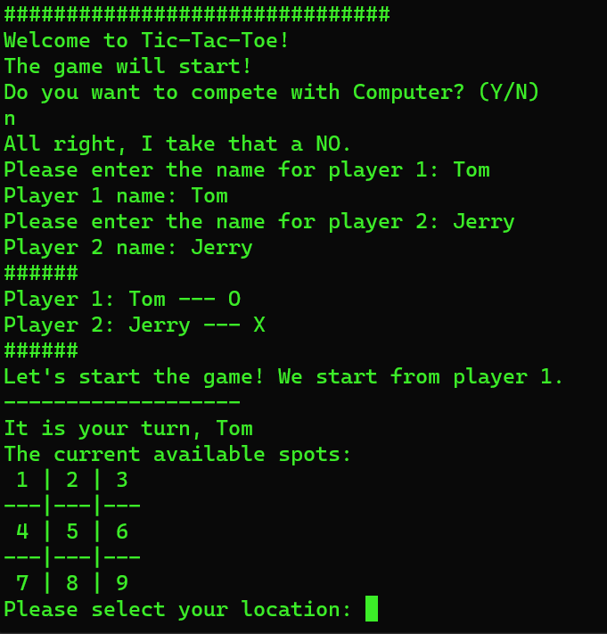

# TicTacToeInCpp
 A simple console based Tic-Tac-Toe game implemented in C++.

A small project for C++ program beginner. Mostly focus on experiencing 
the OOP part of C++ (compared to pure C).

### Supported:
- Multi-player
- Single-player against a simple AI
- Endless game with the same players

### Screenshot


### How to play?
Use `cmake` or compile directly.
#### CMake
```shell
# in the root dir
mkdir build
cd build
cmake ..
cmake --build .
./TicTacToeInCpp
```

#### gcc
```shell
# in the root dir
g++ -o TicTacToeInCpp main.cpp Game.cpp logic.cpp
./TicTacToeInC
```

### Related
[TicTacToeInC](https://github.com/fanfanliye/TicTacToeInC): The same program implemented 
in pure C.